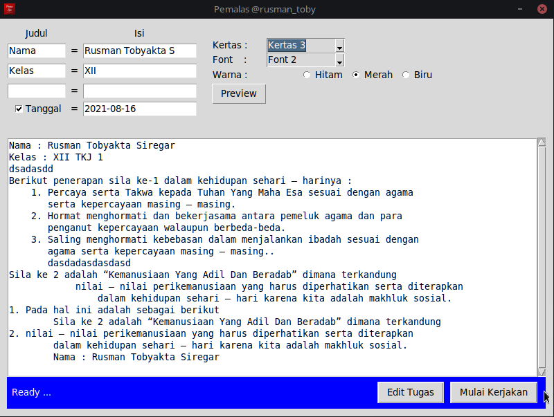
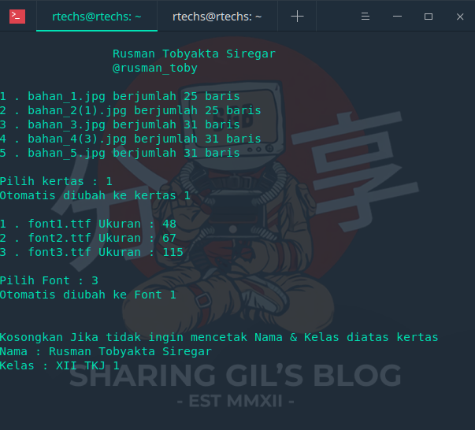

# bot_tulis

<b>Module : Pillow</b>

1. git clone https://github.com/RTechnoS/bot_tulis
2. cd bot_tulis
3. pip install -r requirements.txt
4. Edit file tugas.txt dengan text tugas kalian

Versi GUI :
1. python3 main.py
2. Setting sesuai keinginan
3. Hasil disimpan di folder hasil/

Versi CMD :
1. python3 cmd.py

--> pilih salah satu kertas 
--> pilih salah satu font 
--> Masukkan Nama (opsional) 
--> Masukkan Kelas (opsional) 

2. Proses Berhasil disimpan di folder hasil/

Untuk kertas dan font lebih banyak
bisa menggunakan BOT telegram saya
https://t.me/awakmalas_bot

# Copyright © 2020 Rusman TS
Instagram : @rusman_toby

Email : rusmants.public@pm.me

