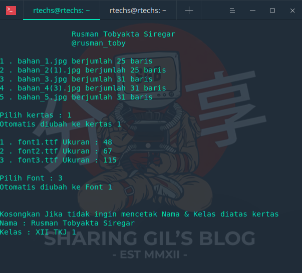

# bot_tulis

<b>Module : Pillow, time, os</b>

1. git clone https://github.com/RTechnoS/bot_tulis
2. cd bot_tulis
4. Edit file Tulisan.txt dengan text tugas kalian
3. python3 main.py

--> pilih salah satu kertas 
--> pilih salah satu font 
--> Masukkan Nama (opsional) 
--> Masukkan Kelas (opsional) 

* Jika ada error silahkan diulang

5. Proses Berhasil disimpan di folder hasil/

Untuk kertas dan font lebih banyak
bisa menggunakan BOT telegram saya
https://t.me/awakmalas_bot

# Copyright © 2020 Rusman TS
Instagram : @rusman_toby

Email : rusmants.public@pm.me

