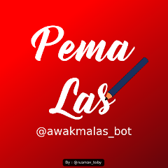
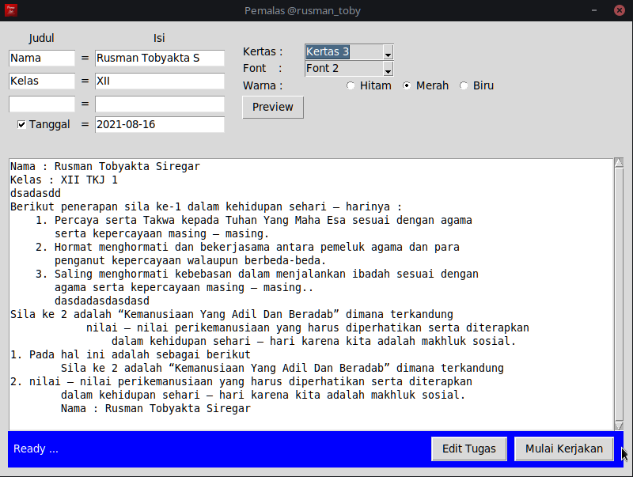
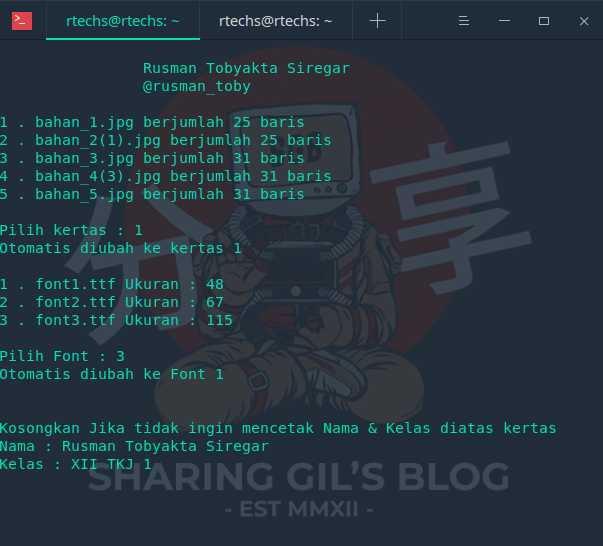

<div align="center">



# Bot Pemalas

### Simulasi Tulisan Tangan di Kertas Bergaris

[](https://www.gnu.org/licenses/gpl-3.0)
[](https://www.python.org/)
[](https://python-pillow.org/)
[](https://github.com/RTechnoS/bot_tulis)

<br>




</div>

---

## Tentang

**Bot Pemalas** adalah aplikasi desktop Python yang mengubah teks ketik menjadi gambar tulisan tangan di kertas bergaris. Teks ditulis otomatis menggunakan font tulisan tangan dengan posisi dan spasi yang sudah dikalibrasi per template kertas.

Dikembangkan dari Telegram bot [@awakmalas_bot](https://t.me/awakmalas_bot) dan diadaptasi untuk penggunaan lokal.

---

## Fitur

- 5 template kertas bergaris (spasi & kapasitas berbeda)
- 3 font tulisan tangan
- 3 warna tinta: hitam `(42,43,43)`, merah `(168,9,12)`, biru `(6,14,118)`
- Header otomatis: Nama, Kelas, Tanggal, dan field custom
- Auto-wrap text (berdasarkan jumlah karakter per baris)
- Multi-page hingga 2 halaman
- Dua mode: GUI (tkinter) dan Command Line

---

## Requirements

- Python 3.x
- Pillow (`pip install -r requirements.txt`)

---

## Instalasi

```bash
# Clone repository
git clone https://github.com/RTechnoS/bot_tulis

# Masuk ke directory
cd bot_tulis

# Install dependensi
pip install -r requirements.txt
```

---

## Penggunaan

### 1. Siapkan Tugas

Edit file `tugas.txt` dengan isi tugas kamu:

```
Bab 1: Pengertian IPTEK
IPTEK adalah Ilmu Pengetahuan dan Teknologi...
```

### 2. Jalankan

**GUI:**

```bash
python3 main.py
```

**Command Line:**

```bash
python3 cmd.py
```

### 3. Konfigurasi

#### Paper Template

| No. | File | Max Baris | Spasi (px) | Sumber Teks |
|:---:|------|:---------:|:----------:|:------------|
| 1 | `bahan_1.jpg` | 25 | 92 | `[531, 347]` |
| 2 | `bahan_2(1).jpg` | 25 | 104 | `[570, 322]` |
| 3 | `bahan_3.jpg` | 25 | 103 | `[605, 305]` |
| 4 | `bahan_4.jpg` | **31** | 92 | `[505, 280]` |
| 5 | `bahan_5(4).jpg` | **31** | 94 | `[515, 313]` |

> Template 4-5 memiliki lebih banyak baris (31) untuk tulisan yang lebih rapat.

#### Font

| No. | File | Ukuran | Max Karakter/Baris |
|:---:|------|:------:|:-------------------:|
| 1 | `font1.ttf` | 48px | 79 - 89 |
| 2 | `font2.ttf` | 67px | 74 - 82 |
| 3 | `font3.ttf` | 61px | 67 - 76 |

> Jumlah karakter per baris bervariasi tergantung kombinasi font dan kertas.

#### Max Karakter per Baris (Lengkap)

| Font \ Kertas | 1 | 2 | 3 | 4 | 5 |
|:-------------:|:-:|:-:|:-:|:-:|:-:|
| **Font 1** (48px) | 79 | 86 | 86 | 85 | 89 |
| **Font 2** (67px) | 74 | 82 | 82 | 78 | 78 |
| **Font 3** (61px) | 67 | 73 | 73 | 75 | 76 |

### 4. Hasil

Gambar tersimpan di folder `hasil/` dengan format nama: `{YYMMDD-HHMMSS}({nomor_halaman}).jpg`

Contoh: `210816-101340(1).jpg`, `210816-101340(2).jpg`

---

## Header / Info

Bagian header ditampilkan di atas kertas sebelum teks utama.

| Field | Format di Kertas | Posisi |
|-------|-----------------|--------|
| `nama` | `Nama : Rusman` | Kiri atas |
| `kelas` | `Kelas : XII TKJ 1` | Kiri atas |
| `tanggal` | `2021-08-16` | Kanan atas (terpisah) |
| Custom | `Mata Pelajaran : BK` | Kiri atas |

> Field `nama` dan `kelas` memiliki format khusus dengan prefix "Nama :" dan "Kelas :". Field custom menggunakan format `{key} : {value}`.

---

## Batasan

- **Maksimal 2 halaman** per generasi
- **Kapasitas maksimal:**
  - Kertas 1-3: 25 baris/halaman = **50 baris max**
  - Kertas 4-5: 31 baris/halaman = **62 baris max**
- Auto-wrap memotong teks per karakter (bukan per kata), sehingga kata bisa terpotong di tengah
- Input selalu dibaca dari `tugas.txt`

---

## Perbedaan GUI vs CMD

| Fitur | GUI | CMD |
|-------|:---:|:---:|
| Pilihan kertas & font | ✓ | ✓ |
| Nama & Kelas | ✓ | ✓ |
| Field custom (bebas) | ✓ | ✗ |
| Tanggal otomatis | ✓ | ✗ |
| Pilihan warna tinta | ✓ | ✗ |
| Preview teks | ✓ | ✗ |
| Editor teks bawaan | ✓ | ✗ |

---

## Struktur Project

```
bot-pemalas-gui/
├── main.py          # GUI (tkinter)
├── cmd.py           # Command-line interface
├── pemalas.py       # Core engine (rendering)
├── tugas.txt        # Input teks tugas
├── requirements.txt # Dependensi (Pillow)
├── LICENSE          # GPL v3
├── bahan/           # Aset
│   ├── bahan_*.jpg  # 5 template kertas
│   └── font*.ttf    # 3 font tulisan tangan
├── hasil/           # Output gambar
└── media/           # Logo & screenshot
```

---

## Bot Telegram

Untuk lebih banyak pilihan kertas dan font, gunakan bot Telegram:

**[@awakmalas_bot](https://t.me/awakmalas_bot)**

---

## Contributing

1. Fork repository ini
2. Buat branch baru (`git checkout -b feature/nama-fitur`)
3. Commit perubahan (`git commit -m 'Tambah fitur baru'`)
4. Push ke branch (`git push origin feature/nama-fitur`)
5. Buka Pull Request

Silakan buka [Issues](https://github.com/RTechnoS/bot_tulis/issues) untuk bug atau saran.

---

## License

GNU General Public License v3.0 - lihat [LICENSE](LICENSE) untuk detail.

---

## Author

**Rusman Tobyakta Siregar**

<div>

[](https://github.com/rtechnos)
[](https://instagram.com/rusman_toby)
[](mailto:rusmants.public@pm.me)

</div>

---

<div align="center">

<a href="https://trakteer.id/rtechs/tip" target="_blank"></a>

</div>
